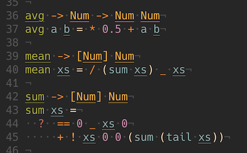

# portcullis.vim

File detection and syntax highlighting for the [Portcullis](https://github.com/jzwood/portcullis) language.

## Usage with Pathogen

Clone this repo into your `/bundle` directory (e.g. `~/.vim/bundle/` or `~/.config/nvim/bundle/`).

```
bundle
└── portcullis-vim
    ├── LICENSE
    ├── README.md
    ├── ftdetect
    │   └── portcullis.vim
    └── syntax
        └── portcullis.vim
```

Re-open your `portcullis` code and you're good to go!


